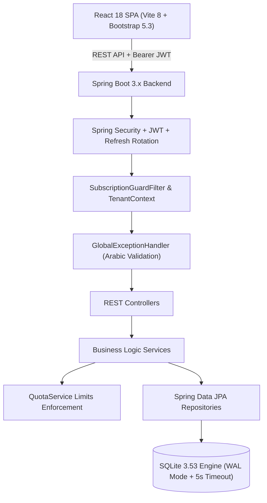
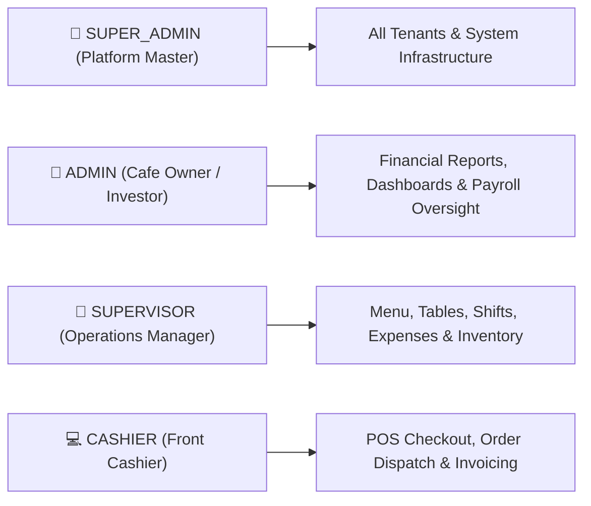
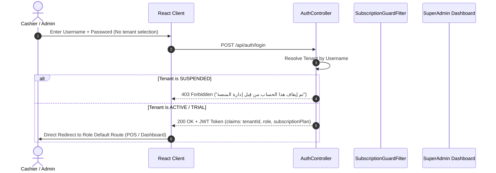

# ☕ Caffio Enterprise — Comprehensive System Documentation & Architecture Guide
**Version:** 2.5.0 (Production SaaS Edition)  
**Last Updated:** August 2026  
**Language:** Bilingual (English Architectural Reference with Arabic Domain Terms)

---

## 📌 1. Executive Summary & Business Overview

### 1.1 Product Vision
**Caffio Enterprise** is an enterprise-grade, multi-tenant SaaS point-of-sale (POS) and operations management platform tailored for modern cafés, coffee shops, specialty roasteries, lounges, and restaurants. The platform combines high-speed POS checkout, real-time Kitchen Display Systems (KDS), multi-register shift management, inventory tracking, customer debt ledgers, employee payroll with salary advances, and centralized SaaS platform administration.

### 1.2 SaaS Business & Monetization Model
Caffio operates on a tiered subscription and license-key architecture:

| Tier | Target Business | Price (EGP) | Table Quota | User Quota | Menu Items | Included Modules |
| :--- | :--- | :--- | :--- | :--- | :--- | :--- |
| **TRIAL** | New Onboarding | **Free (14 Days)** | Up to 5 | Up to 2 | Up to 30 | POS, Table Layout, Cashier |
| **STARTER** | Small Boutique Cafés | **499 / Month** | Up to 10 | Up to 4 | Up to 100 | POS, Shift Expenses, Thermal Print |
| **PRO** ⭐ | Busy Cafés & Lounges | **899 / Month** | Up to 25 | Up to 8 | Unlimited ♾ | KDS, Debt Ledgers, Shift Expenses, Reports |
| **ENTERPRISE** | Multi-Branch / Restos | **1,499 / Month** | Unlimited ♾ | Unlimited ♾ | Unlimited ♾ | Custom Branding, VIP Support, Unlimited |

#### 🔑 License Key System
For offline installations, annual bulk purchases, or direct sales:
- Super Admin generates cryptographically unique license keys (`CAFF-PRO-XXXX-XXXX`).
- Tenant enters the key via Settings to activate/extend subscription without requiring manual online billing.

---

## 🏗️ 2. Technical Stack & System Architecture



### 2.1 Technology Matrix
- **Backend**: Java 21, Spring Boot 3.x, Spring Data JPA, Hibernate, Spring Security.
- **Security**: HMAC-SHA256 JWT Authentication, Refresh Token Rotation, BCrypt password hashing (`strength 12`).
- **Database**: SQLite 3.53 configured in **WAL Mode (Write-Ahead Logging)** with a 5000ms busy timeout for zero concurrency locks.
- **Frontend**: React 18, Vite 8.x, Bootstrap 5.3, Bootstrap Icons, Lucide React, HTML5 Web Audio API.
- **Styling & Typography**: Custom High-Contrast Slate/Obsidian Palette (`#090d16`, `#0f172a`, `#131d31`, `#f59e0b`), Arabic Typography via Google Font `Cairo`.

### 2.2 Multi-Tenancy Architecture
- **Isolation Strategy**: Single-database logical schema isolation.
- Every business table (`cafe_tables`, `orders`, `order_items`, `products`, `categories`, `shifts`, `expenses`, `debts`, `employees`, `users`, `invoices`) contains a `tenant_id` column.
- **Tenant Context (`TenantContext`)**: Managed via `ThreadLocal<Long>`. Requests resolve `tenant_id` strictly from verified JWT claims or login resolution.
- **Zero-Cross Contamination**: All repository queries are scoped by `tenant_id` to prevent IDOR attacks.

---

## 👥 3. Role-Based Access Control (RBAC)

The system enforces strict 4-tier role separation:



### 3.1 Role Permission Matrix

| Feature / Module | CASHIER | SUPERVISOR | ADMIN | SUPER_ADMIN |
| :--- | :---: | :---: | :---: | :---: |
| **Point of Sale (POS) & Checkout** | ✅ Full | ✅ Full | ❌ (Observer) | ❌ |
| **Kitchen Display (KDS)** | ✅ Full | ✅ Full | ❌ (Observer) | ❌ |
| **Menu CRUD (Products & Categories)** | ❌ Read Only | ✅ Full CRUD | 👁️ View Only | ❌ |
| **Table Layout & Management** | ❌ Read Only | ✅ Full CRUD | 👁️ View Only | ❌ |
| **Shifts (Open / Close / Print)** | ✅ Own Shift | ✅ Force Close | 👁️ Audit View | ❌ |
| **Expenses Recording** | ✅ Record | ✅ Record/Edit | 👁️ Audit View | ❌ |
| **Debts & Customer Credit** | ❌ | ✅ Full CRUD | 👁️ View Ledgers | ❌ |
| **Employee Payroll & Reset Cycle** | ❌ | ✅ Full CRUD | 👁️ View Payroll | ❌ |
| **Inventory & Stock Adjustments** | ❌ Read Only | ✅ Full CRUD | 👁️ View Only | ❌ |
| **Financial & Business Reports** | ❌ | ✅ View Reports | ✅ View Reports | ❌ |
| **Tenant User Management** | ❌ | ✅ Cashiers/Supervisors | ✅ All Users | ❌ |
| **Platform Master Portal (`/super-admin`)** | ❌ | ❌ | ❌ | ✅ Full Control |

---

## 📦 4. Core System Modules & Business Workflows

### 4.1 Authentication & Multi-Tenant Lifecycle



### 4.2 Point of Sale (POS) & Order Lifecycle
1. **Table Grid**: Real-time table states (`AVAILABLE`, `OCCUPIED`, `BILLING`).
2. **Order Dispatch**: Cashier adds items with quantity modifiers and notes, then clicks **"إرسال للمطبخ" (Send to Kitchen)**.
3. **Auto Inventory Deduction**: Dispatching items automatically decrements `stockQuantity` for inventory-tracked products. If stock hits 0, `product.available` is marked `false`.
4. **Auto Service Charge**: For `DINE_IN` orders, the system automatically applies the tenant's configured service charge percentage to the subtotal.
5. **Checkout & Split Payments**: Supports `CASH`, `CARD`, `CREDIT` (Debt). Upon payment, receipt is printed and table returns to `AVAILABLE`.

### 4.3 Kitchen Display System (KDS)
- Items are routed based on station codes (`KITCHEN` vs `BAR`).
- Displays elapsed time since order creation with color alerts (Green < 5 min, Amber 5-10 min, Red > 10 min).
- Audio notifications upon new order arrival.

### 4.4 Shift & Multi-Register Engine
- Allows multiple registers to operate concurrently within the same tenant.
- Shift records opening cash float, total cash sales, card sales, expenses recorded during shift, and expected vs actual closing cash drawer reconciliation.

### 4.5 Debt Management & Customer Accounts
- Tracks outstanding balances for recurring café customers and employees.
- Allows partial and full settlements with historical payment audit logs.

### 4.6 Employee Payroll & Advance System
- Tracks employee base salaries, shift attendance, bonuses, and salary advances/deductions.
- Includes a weekly/monthly **"إعادة تعيين الأسبوع" (Reset Cycle)** for payroll settlement.

---

## 👑 5. Super Admin Master Portal (`/super-admin`)

The central control tower for platform owners:
- **Dashboard & KPIs**: 8 Real-time KPI cards (Total Tenants, Active, Trial, Suspended, Estimated MRR, Paid Subscriptions, Total Seat Capacity, License Keys).
- **MRR Revenue Growth Chart**: Monthly historical and projected revenue trends.
- **Tenant Management Data Table**: Search, filter by status (`ACTIVE`, `TRIAL`, `SUSPENDED`) and plan (`TRIAL`, `STARTER`, `PRO`, `ENTERPRISE`), sort, CSV export, batch actions.
- **Instant Suspension Engine**: 1-click account suspension instantly blocks tenant logins (`403 Forbidden`) and API operations.
- **License Key Generator**: Generates cryptographically secure offline license keys with customized validity periods (e.g., 365 days or Lifetime).
- **Audit Logs Trail**: Chronological immutable log of all administrative actions.

---

## 🚨 6. Centralized Arabic Validation & Error Handling

The backend implements a unified `@RestControllerAdvice` [`GlobalExceptionHandler`](file:///C:/Users/alaae/.gemini/antigravity/worktrees/cafe-mangment-system/initialize_frontend_worktree/src/main/java/com/example/cafemangmentsystem/common/exception/GlobalExceptionHandler.java):

```json
{
  "timestamp": "2026-08-27T03:53:56Z",
  "status": 400,
  "error": "VALIDATION_FAILED",
  "message": "اسم الصنف مطلوب، سعر الصنف مطلوب",
  "errors": [
    { "field": "nameAr", "message": "اسم الصنف مطلوب" },
    { "field": "price", "message": "سعر الصنف مطلوب" }
  ]
}
```

### Handled Error Categories:
- **Form Validation (`MethodArgumentNotValidException`)**: Aggregates all field constraints into clear Arabic text.
- **Plan Quotas (`QuotaExceededException`)**: Returns `403 Forbidden` with exact resource name in Arabic.
- **Account Suspension (`DisabledException`)**: *"تم إيقاف هذا الحساب من قِبل إدارة المنصة. يرجى التواصل مع الدعم الفني للتفعيل."*
- **Authentication (`BadCredentialsException`)**: *"اسم المستخدم أو كلمة المرور غير صحيحة."*
- **Authorization (`AccessDeniedException`)**: *"ليس لديك الصلاحية الكافية لإتمام هذا الإجراء."*

---

## 🔌 7. REST API Reference (Selected Key Endpoints)

### Authentication & Tenant
- `POST /api/auth/login` — Authenticate user via username + password; auto-resolves tenant.
- `POST /api/auth/super-admin/login` — Authenticate Super Admin into the platform master portal.
- `POST /api/auth/refresh` — Rotate refresh token for a new JWT.
- `GET /api/tenant/me` — Retrieve current tenant profile and quota status.
- `GET /api/tenant/usage` — Retrieve tenant resource usage vs plan limits.

### POS & Orders
- `GET /api/orders/open` — List all active open orders for current tenant.
- `POST /api/orders` — Create new order (Dine-in / Takeaway / Delivery).
- `POST /api/orders/{id}/items` — Append items to an open order.
- `POST /api/orders/{id}/send` — Dispatch order to kitchen and deduct inventory.
- `POST /api/orders/{id}/pay` — Process payment (Cash / Card) and close order.
- `POST /api/orders/{id}/refund` — Issue partial or full refund with reason.

### Shifts & Expenses
- `POST /api/shifts/open` — Open a new cashier shift with starting float.
- `POST /api/shifts/close` — Close active shift with cash reconciliation.
- `GET /api/expenses` — List recorded operational expenses.
- `POST /api/expenses` — Record an expense line item during shift.

### Platform & Super Admin
- `GET /api/admin/tenants/stats` — Retrieve aggregated platform KPIs, MRR, and plan distributions.
- `GET /api/admin/tenants` — List all registered tenants with full quota details.
- `POST /api/admin/tenants/provision` — Provision a new cafe tenant with owner account and plan.
- `PUT /api/admin/tenants/{id}/subscription` — Update plan, status (Active/Suspended), or extend trial.
- `POST /api/admin/licenses` — Generate a new offline license key.
- `DELETE /api/admin/licenses/{id}/revoke` — Revoke an issued license key.

---

## 🚀 8. Developer & Operations Quickstart

### 8.1 Backend Setup (Spring Boot)
```powershell
# Navigate to project root
cd C:\Users\alaae\.gemini\antigravity\worktrees\cafe-mangment-system\initialize_frontend_worktree

# Build and compile
./mvnw clean compile -q

# Run Spring Boot application (Port 8080)
./mvnw spring-boot:run
```

### 8.2 Frontend Setup (React Vite)
```powershell
# Navigate to frontend directory
cd frontend

# Install dependencies
npm install

# Run Vite dev server (Port 5173 / 5174)
npm run dev

# Build for production
npm run build
```

### 8.3 Default System Credentials
- **Super Admin Portal**: `/super-admin/login` ➔ `superadmin` / `SuperAdmin@123`
- **Demo Café Admin**: `/login` ➔ `admin` / `AdminPassword123!`
- **Demo Cashier**: `/login` ➔ `ahmed` / `123456`

---

## 🛡️ 9. Security & Reliability Highlights
1. **SQLite Concurrency**: Handled via WAL mode and 5000ms busy timeouts to eliminate `SQLITE_BUSY` errors.
2. **Zero-Trust Multi-Tenancy**: Data separation guaranteed at the service and repository boundary.
3. **Automated Trial & Subscription Enforcement**: Expired trials and suspended tenants are immediately cut off at both the authentication and filter layers.
4. **Production Build Cleanliness**: 0 build errors, 0 lint warnings, fully responsive across desktop, tablet, and mobile browsers.

---
*Documentation compiled and maintained for Caffio Enterprise Platform.*
